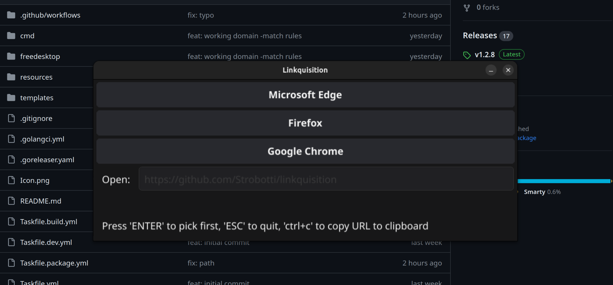
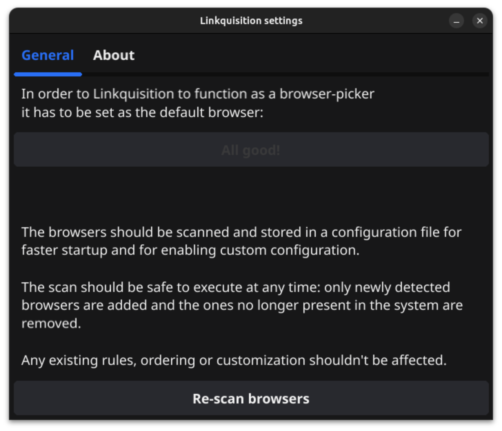

# Linkquisition


Linkquisition is a fast, configurable browser-picker for Linux desktop written in Go.

...as nobody expects the Linkquisition!



## What is it?

Motivation behind this project is:
1. I needed a fast browser-picker for Linux desktop that is configurable to automatically choose a browser based on different rules
2. I have written a lot of server-side code in Go and wanted to see how easy it is to write a desktop app in Go

## Features

- Fast
- Configurable
  - Automatically chooses a browser based on different rules
    - domain (e.g. `example.com`)
    - site (e.g. `www.example.com`)
    - regular expression (e.g. `.*\.example\.com`)
  - Hide a browser from the list
  - Manually add a browser to the list (for example, to open a URL in a different profile)
  - Remember the choice for given site
- keyboard-shortcuts
  - `Enter` to open the URL in the default browser
  - `Ctrl+C` to just copy the URL to clipboard and close the window
  - Number keys (1-9) to select a browser

## Installation

You can download the latest `.deb` package from the [releases page](https://github.com/Strobotti/linkquisition/releases).

The installation contains everything needed to launch the application using the desktop-environment, e.g. you should be 
able to press `Super`-key in Ubuntu and type "Linkquisition" to see the launcher. To do the same in terminal just run
`linkquisition` command. Launching the application without any arguments will show the configuration screen which allows
you to set it as the default browser and scan for installed browsers for faster startup and easier configuration.

## Configuration



As mentioned in the installation section, you can launch the application without any arguments to show the configuration
screen.

To set Linkquisition as the default browser, you can click the "Set as default" button and after this any links opened
(outside browsers) will either show you the screen to choose a browser, or open one automatically if configured so.

The configuration file is located at `~/.config/linkquisition/config.json` and clicking the "Scan browsers" button will
create one if it does not exist, or update it with the currently installed browsers. Re-scanning later will not remove
any manually added browsers or rules to existing browsers.

If adding a browser-entry manually to the config.json be sure to mark it as "manual" to prevent it from being removed
on next scan. Also, if you want to hide a browser from the list, you can have it's "hidden" -attribute with value `true`.

Please note that the scan will use the "command" -attribute as the identifier for the browser, so if change the command
it will be treated as a different browser and might be removed if not safe-guarded with `"source": "manual"` -setting.

### An example config.json -file

```json
{
  "browsers": [
    {
      "name": "Microsoft Edge",
      "command": "/usr/bin/microsoft-edge-stable %U",
      "hidden": false,
      "source": "auto",
      "matches": [
        {
          "type": "site",
          "value": "www.office.com"
        }
      ]
    },
    {
      "name": "Firefox",
      "command": "firefox %u",
      "hidden": false,
      "source": "auto",
      "matches": [
        {
          "type": "site",
          "value": "www.facebook.com"
        }
      ]
    }
  ]
}
```


## Development

I am using Ubuntu Linux for development, so the instructions are tailored for that. However, the code should work on any
Freedesktop.org-compliant Linux distribution, although I have not tested it. Also, I have limited the architecture to
amd64, as I do not have time/access to other architectures for testing easily.

### Requirements

- Go 1.21 (https://go.dev/doc/install)
- Taskfile (https://taskfile.dev/#/installation)
- Build-dependencies:
  ```shell
  sudo apt-get update && sudo apt-get install -y gcc libgl1-mesa-dev xorg-dev
  ```

### Building locally

The following command will build a binary in the `bin` directory:

```bash
task build # results in bin/linkquisition-linux-amd64
```

To run in watch mode:

```bash
task build --watch # results in bin/linkquisition-linux-amd64 (rebuilds on any relevant file change)
```

### Packaging locally

Packaging locally is for testing purposes only, actual packaging should be done in a CI/CD pipeline,
which currently is Github.com Actions.

The following command will build a `.deb` package in the `dist` directory:

```bash
# export VERSION=0.1.0-dev # optional, if not set, defaults to 0.0.0
task package:deb # results in dist/linkquisition_0.0.0_amd64.deb
```

## Experimental plugin-system

See [plugins](./plugins/README.md) for more information.

## TODO

- [X] Add support for plugins
- [ ] Add support for translations
- [X] Add support for browser icons
- [ ] Add support for more platforms
- [ ] Add support for more architectures
- [ ] Add support for more package-formats


With the above list the most interesting feature for me personally is the plugins -feature, as it would allow for
doing some more complex processing of the URL before opening it in a browser. For example, I could write a plugin that
strips any tracking parameters from the URL before opening it in the browser.

~~I also would like to have a plugin that checks if the opened url is a Microsoft Defender (Evergreen) URL and then, with
matching rules, opens the actual url (baked in the "evergreen-assets URL") in a browser. This way all the internal
links in my company could be opened directly in the browser, but the external links would still go through the Defender
URL.~~ See [Unwrap](./plugins/unwrap/unwrap.go) -plugin for more information.
