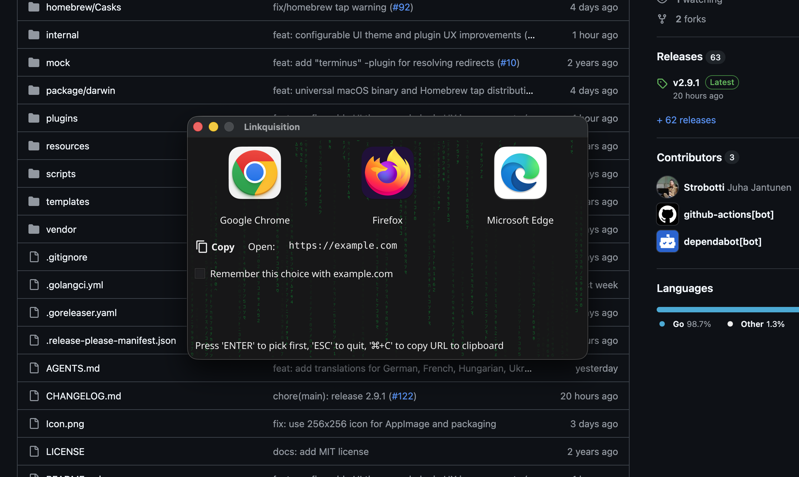
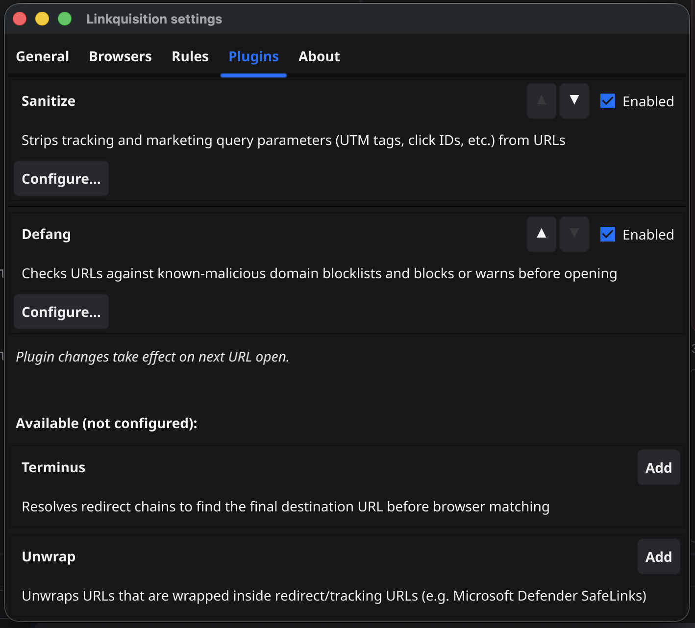

# Linkquisition


Linkquisition is a fast, configurable browser-picker for Linux (and experimentally macOS) written in Go.

...as nobody expects the Linkquisition!



## What is it?

Motivation behind this project is:

1. I needed a fast browser-picker for Linux desktop that is configurable to automatically choose a browser based on
   different rules
2. I have written a lot of server-side code in Go and wanted to see how easy it is to write a desktop app in Go

## Features

- Fast
- Configurable
    - Automatically chooses a browser based on different rules
        - domain (e.g. `example.com`)
        - site (e.g. `www.example.com`)
        - regular expression (e.g. `.*\.example\.com`)
    - Hide a browser from the list
    - Manually add a browser to the list (for example, to open a URL in a different profile)
    - Remember the choice for given site
- keyboard-shortcuts
    - `Enter` to open the URL in the default browser
    - `Ctrl+C` to just copy the URL to clipboard and close the window
    - Number keys (1-9) to select a browser

## Installation

### Linux

You can download the latest `.deb` package or portable AppImage from
the [releases page](https://github.com/Strobotti/linkquisition/releases).

#### .deb package (Ubuntu/Debian)

The `.deb` package contains everything needed to launch the application using the desktop-environment, e.g. you should
be
able to press `Super`-key in Ubuntu and type "Linkquisition" to see the launcher. To do the same in terminal just run
`linkquisition` command. Launching the application without any arguments will show the configuration screen which allows
you to set it as the default browser and scan for installed browsers for faster startup and easier configuration.

#### AppImage (any distribution)

The AppImage is a single portable file that works on any Linux distribution without installation:

```bash
chmod +x Linkquisition-*-x86_64.AppImage
./Linkquisition-*-x86_64.AppImage
```

### macOS

#### Via Homebrew (recommended)

```bash
brew tap strobotti/tap
brew install --cask linkquisition
```

Since the app is not notarized with Apple, macOS will block it on first launch. To fix this, run:

```bash
xattr -cr /Applications/Linkquisition.app
```

#### Manual installation

Download the latest `Linkquisition_macOS_universal.zip` from
the [releases page](https://github.com/Strobotti/linkquisition/releases), unzip it, and move
`Linkquisition.app` to `/Applications`.

The universal binary supports both Apple Silicon (arm64) and Intel (amd64) Macs.

Since the app is not notarized with Apple, macOS will block it on first launch. To fix this, run:

```bash
xattr -cr /Applications/Linkquisition.app
```

## Configuration



As mentioned in the installation section, you can launch the application without any arguments to show the configuration
screen.

To set Linkquisition as the default browser, you can click the "Set as default" button and after this any links opened
(outside browsers) will either show you the screen to choose a browser, or open one automatically if configured so.

The configuration file is located at `~/.config/linkquisition/config.json` and clicking the "Scan browsers" button will
create one if it does not exist, or update it with the currently installed browsers. Re-scanning later will not remove
any manually added browsers or rules to existing browsers.

If adding a browser-entry manually to the config.json be sure to mark it as "manual" to prevent it from being removed
on next scan. Also, if you want to hide a browser from the list, you can have it's "hidden" -attribute with value
`true`.

Please note that the scan will use the "command" -attribute as the identifier for the browser, so if change the command
it will be treated as a different browser and might be removed if not safe-guarded with `"source": "manual"` -setting.

### An example config.json -file

```json
{
  "locale": "",
  "browsers": [
    {
      "name": "Microsoft Edge",
      "command": "/usr/bin/microsoft-edge-stable %U",
      "iconPath": "/usr/share/icons/hicolor/128x128/apps/microsoft-edge.png",
      "hidden": false,
      "source": "auto",
      "matches": [
        {
          "type": "site",
          "value": "www.office.com"
        }
      ]
    },
    {
      "name": "Firefox",
      "command": "firefox %u",
      "iconPath": "/usr/share/icons/hicolor/128x128/apps/firefox.png",
      "hidden": false,
      "source": "auto",
      "matches": [
        {
          "type": "site",
          "value": "www.facebook.com"
        }
      ]
    }
  ]
}
```

### Localization

Linkquisition supports localization. The UI language is determined in the following order:

1. If `locale` is set in `config.json` (e.g. `"locale": "fi"`), that locale is used
2. Otherwise, the system locale is auto-detected
3. If no matching translation is available, English is used as fallback

Currently supported languages:

- English (en) — default
- Brazilian Portuguese (pt-BR)
- Finnish (fi)
- French (fr)
- German (de)
- Hungarian (hu)
- Portuguese (pt)
- Spanish (es)
- Swedish (sv)
- Ukrainian (uk)

To contribute a new translation, add a JSON file to `internal/i18n/translations/` following the
format of the existing files (e.g. `en.json`). The filename should be the locale code (e.g. `de.json` for German).

## Command-line interface

In addition to the GUI, Linkquisition provides a full CLI for scriptable configuration:

```bash
# Show help
linkquisition --help

# Version
linkquisition --version

# Configuration
linkquisition config                        # show full config as JSON
linkquisition config get logLevel           # get a single value
linkquisition config set logLevel debug     # set a value
linkquisition config set ui.theme dark      # set UI theme (system/dark/light)
linkquisition config path                   # print config file path

# Plugin management
linkquisition plugin list                   # list configured + available plugins
linkquisition plugin enable <name>          # enable a plugin
linkquisition plugin disable <name>         # disable a plugin
linkquisition plugin add <name>             # add an available plugin with defaults

# Browser management
linkquisition browsers list                 # list configured browsers
linkquisition browsers scan                 # scan system for installed browsers

# Match rules
linkquisition rule list                     # list all URL match rules
linkquisition rule list firefox             # list rules for a specific browser
linkquisition rule add firefox site github.com        # add a rule
linkquisition rule add chrome regex ".*\.example\.com"  # add a regex rule
linkquisition rule remove firefox 1         # remove rule by index

# Set as default browser
linkquisition set-default

# Test/trace URL processing (dry run)
linkquisition test-url "https://example.com/page?utm_source=twitter"

# Override plugin settings at runtime (not persisted)
linkquisition --plugin-opt shenanigans.effect=matrix "https://example.com"
```

On macOS, the binary is located at `/Applications/Linkquisition.app/Contents/MacOS/linkquisition`.
You can create a symlink for convenience:

```bash
ln -s /Applications/Linkquisition.app/Contents/MacOS/linkquisition /usr/local/bin/linkquisition
```

## Development

I am using Ubuntu Linux for development, so the instructions are tailored for that. However, the code should work on any
Freedesktop.org-compliant Linux distribution, although I have not tested it. Also, I have limited the architecture to
amd64, as I do not have time/access to other architectures for testing easily.

### Requirements

- Go 1.25 (https://go.dev/doc/install)
- Taskfile (https://taskfile.dev/#/installation)
- Build-dependencies:
  ```shell
  sudo apt-get update && sudo apt-get install -y gcc libgl1-mesa-dev xorg-dev scdoc
  ```

### Building locally

The following command will build a binary in the `bin` directory:

```bash
task build # results in bin/linkquisition-linux-amd64
```

To run in watch mode:

```bash
task build --watch # results in bin/linkquisition-linux-amd64 (rebuilds on any relevant file change)
```

### Packaging locally

Packaging locally is for testing purposes only, actual packaging should be done in a CI/CD pipeline,
which currently is Github.com Actions.

The following command will build a `.deb` package in the `dist` directory:

```bash
# export VERSION=0.1.0-dev # optional, if not set, defaults to 0.0.0
task package:deb # results in dist/linkquisition_0.0.0_amd64.deb
```

## Plugin system

See [plugins](./plugins/README.md) for more information.

## TODO

- [X] Add support for plugins
- [X] Add support for translations
- [X] Add support for browser icons
- [ ] Add support for more platforms
- [ ] Add support for more architectures
- [ ] Add support for more package-formats


With the above list the most interesting feature for me personally is the plugins -feature, as it would allow for
doing some more complex processing of the URL before opening it in a browser. ~~For example, I could write a plugin that
strips any tracking parameters from the URL before opening it in the browser.~~ See
[Sanitize](./plugins/sanitize/sanitize.go) -plugin for more information.

~~I also would like to have a plugin that checks if the opened url is a Microsoft Defender (Evergreen) URL and then,
with
matching rules, opens the actual url (baked in the "evergreen-assets URL") in a browser. This way all the internal
links in my company could be opened directly in the browser, but the external links would still go through the Defender
URL.~~ See [Unwrap](./plugins/unwrap/unwrap.go) -plugin for more information.
