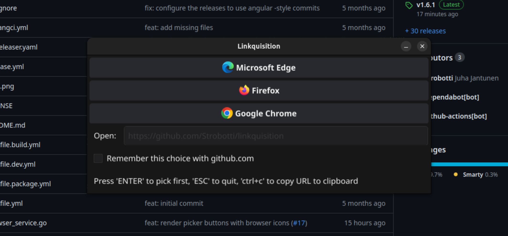

# Linkquisition

Linkquisition is a fast, configurable browser-picker for Linux desktop written in Go.

...as nobody expects the Linkquisition!



## What is it?

Motivation behind this project is:
1. I needed a fast browser-picker for Linux desktop that is configurable to automatically choose a browser based on different rules
2. I have written a lot of server-side code in Go and wanted to see how easy it is to write a desktop app in Go

## Features

- Fast
- Configurable
  - Automatically chooses a browser based on different rules
    - domain (e.g. `example.com`)
    - site (e.g. `www.example.com`)
    - regular expression (e.g. `.*\.example\.com`)
  - Hide a browser from the list
  - Manually add a browser to the list (for example, to open a URL in a different profile)
- keyboard-shortcuts
  - `Enter` to open the URL in the default browser
  - `Ctrl+C` to just copy the URL to clipboard and close the window
  - Number keys (1-9) to select a browser

## Development

I am using Ubuntu Linux for development, so the instructions are tailored for that. However, the code should work on any
Freedesktop.org-compliant Linux distribution, although I have not tested it. Also, I have limited the architecture to
amd64, as I do not have time/access to other architectures for testing easily.

### Requirements

- Go 1.21 (https://go.dev/doc/install)
- Taskfile (https://taskfile.dev/#/installation)
- Build-dependencies:
  ```shell
  sudo apt-get update && sudo apt-get install -y gcc libgl1-mesa-dev xorg-dev
  ```

### Building locally

The following command will build a binary in the `bin` directory:

```bash
task build # results in bin/linkquisition-linux-amd64
```

To run in watch mode:

```bash
task build --watch # results in bin/linkquisition-linux-amd64 (rebuilds on any relevant file change)
```

### Packaging locally

Packaging locally is for testing purposes only, actual packaging should be done in a CI/CD pipeline,
which currently is Github.com Actions.

The following command will build a `.deb` package in the `dist` directory:

```bash
# export VERSION=0.1.0-dev # optional, if not set, defaults to 0.0.0
task package:deb # results in dist/linkquisition_0.0.0_amd64.deb
```
